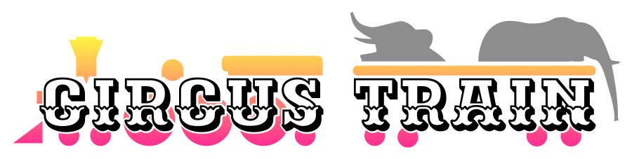

# Table Schema Evolution

## Overview
Circus Train replicates Hive tables, both data and metadata, on request. In doing so, Circus Train's support for schema evolution roughly follows what is supported by Hive.

Broadly, if the schema change is backwards compatible, Circus Train is likely to support it. However, as Circus Train's feature set is continually growing, supported schema evolutions are therefore subject to change. The following table describes exactly what schema evolutions are supported.

## Supported Evolutions (Parquet table format)

Schema Evolution|Supported by Circus Train|Note
|----|----|----|
Additional field|Yes||
Removed field|Yes||
Renamed field|No*|Replication will succeed, but previous data will remain in the original column name|
Add default value to field|Yes||
Remove default value from field|Yes||
Make field nullable|Yes||
Convert field to struct|No*|Replication will succeed, but a `ClassCastException` will be thrown when reading the data|
Add column to struct|Yes||
Remove column from struct|Yes||
Promote int to long, float or double |Yes||
Promote long to float or double |Yes||
Promote float to double |Yes||
Demote long, float or double to int |No*|Replication will succeed, but a `ClassCastException` will be thrown when reading the data
Demote double or float to long|No*|Replication will succeed, but a `ClassCastException` will be thrown when reading the data
Demote double to float |No*|Replication will succeed, but a `ClassCastException` will be thrown when reading the data|
Add value to enum |Yes||
Remove value from enum |Yes*|This seems to still allow the removed enum to be inserted in to the table|

## Tests

A series of integration tests support the findings above. Maven does not run them by default. To run the tests, override the excluded groups property from within the `circus-train-integration-tests` package:

    mvn clean test -Dsurefire.excluded.groups=""